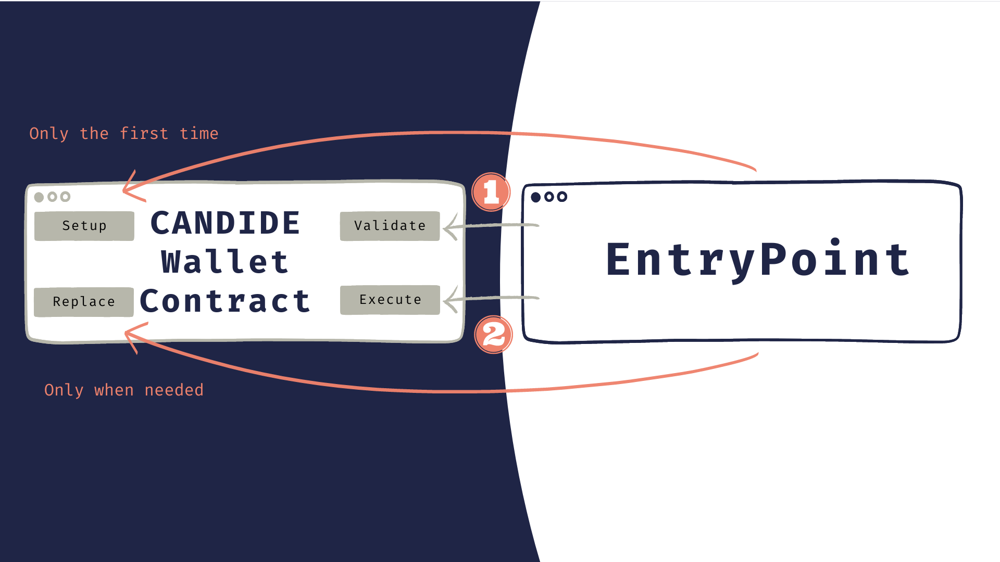
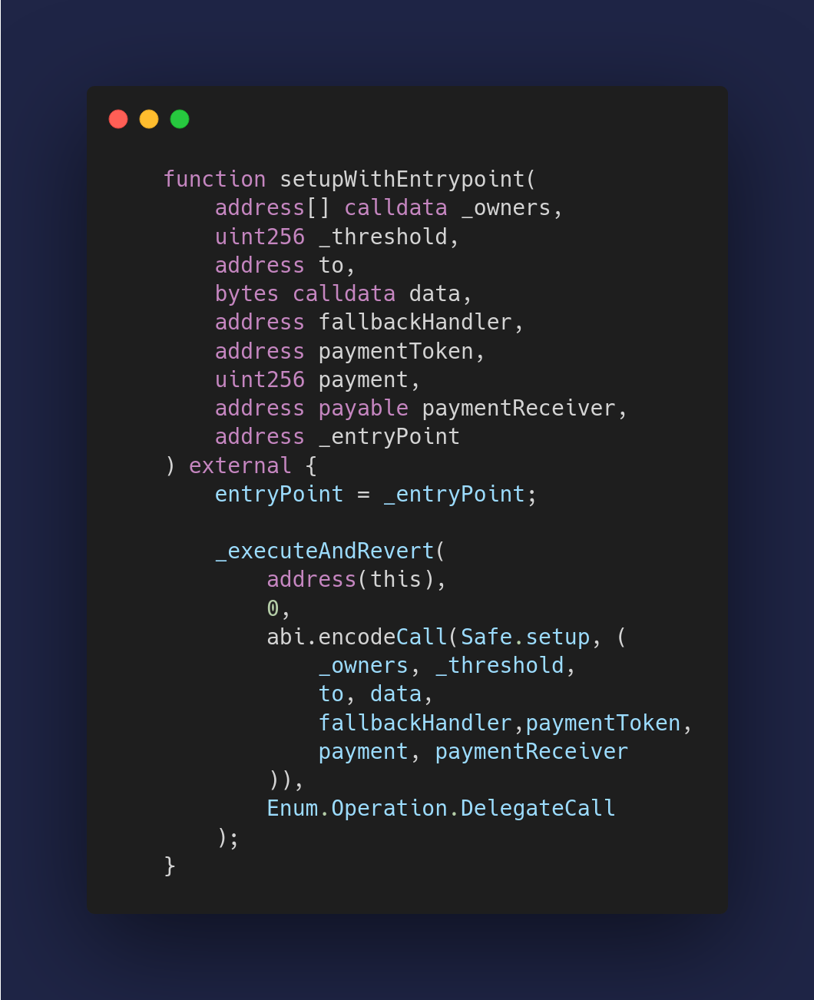
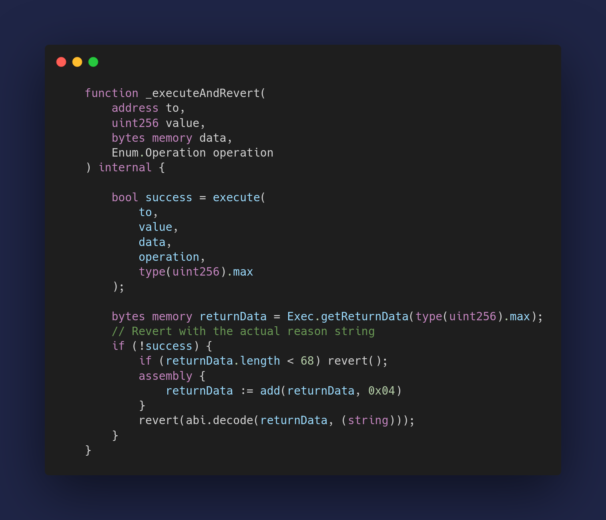
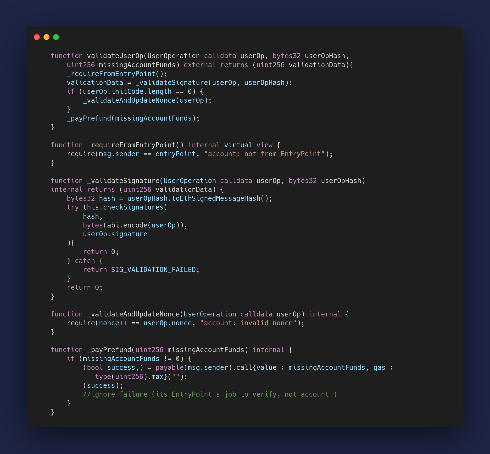
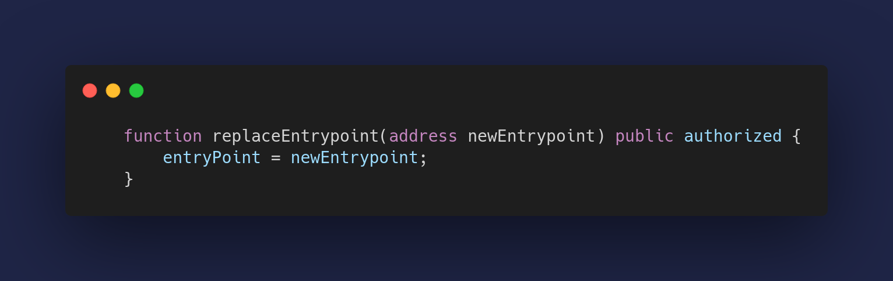

CANDIDE Wallet released its second version of its core contract on testnet, addressing key issues from its previous version. The new contract is simple and doesn't require complex fallbacks or delegate calls like the previous one. Only four methods are added to Safe Contracts, allowing it to be ERC-4337 compatible.

CANDIDE Wallet is an [EIP-4337](https://eips.ethereum.org/EIPS/eip-4337) smart contract wallet. This ERC is a specification to add account abstraction functionality to Ethereum and EVM-compatible chains without modifying the consensus rules.

To understand CANDIDE Contracts, it is vital to know the key component that the Global ERC-4337 EntryPoint contract needs from a Smart Account. A Smart Account needs 2 essential methods for the EntryPoint to interact with it: `validateUserOp` and `execute`. CANDIDE wallet has 2 more methods for both setup and replacing the EntryPoint for upgradability.

### The Setup method 

CANDIDE wallet is a modified version of Safe to accommodate for the entrypoint. The setup method simply calls the setup in Safe with one more argument:  the _entryPoint address 

### The validation method

This method blocks unauthorized users to submit operations for the wallet. It's called by the EntryPoint to validate two things: the user's signature and the nonce.

`_validateSignature` call the signature validation of Safe. It returns zero on success and catches the revert in case the signature is not valid and returns 1 (`SIG_VALIDATION_FAILED`).

`_validateAndUpdateNonce` makes sure that the `nonce` coming from the `UserOperation` is valid and increments the `nonce` for the Account.

The `missingAccountFunds` is the amount that the Account needs to deposit in the EntryPoint to execute the transaction. It is zero in the case a paymaster is sponsoring, or if the Account already has a previous sufficient deposit to cover the gas cost associated.

### The execution method

This function allows the Entrypoint to execute a transaction without any further confirmations. It has to check one condition: Make sure the transaction is indeed coming from Entrypoint.

### Replace EntryPoint
Lastly, if a new EntryPoint is introduced, whether to add new functionality, improve gas efficiency, or fix a critical security bug, users can self-call to replace their account’s code address with a new code address containing code that points to a new EntryPoint 

Those are essentially the four main methods used for CANDIDE Wallet contracts. Find the [CandideWallet.sol](https://github.com/candidelabs/CandideWalletContracts/blob/main/contracts/candideWallet/CandideWallet.sol) on github.

