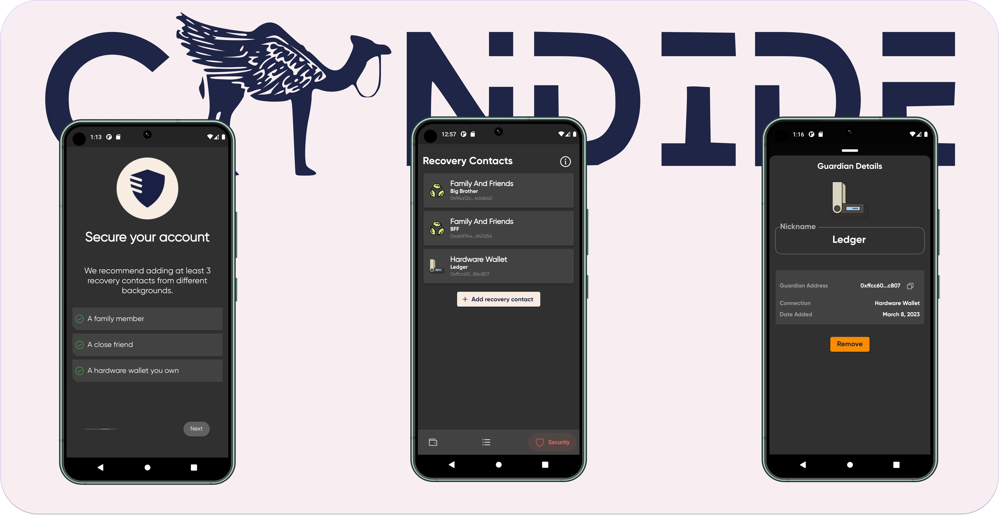

Securing private keys is a major challenge in making Ethereum wallets accessible to everyone. With the constant threat of phishing and targeted attacks, how do we make it easy to manage private keys, and prevent them from being lost and stolen? By abstracting away seed phrases and introducing an account recovery module, Ethereum wallets could reach the same level of security as a multisig wallet, making it easier for both Ethereum pros and the average joe to manage their account security. This model of security has been highlighted in Vitalik's [blog post](https://vitalik.ca/general/2021/01/11/recovery.html).

## How it works

We introduce a new Account Recovery module for CANDIDE Wallet. The Account Recovery module is designed to work for both a single-owner account and an N by M multi-sig account. In the case of the single-owner account, the signer key is typically stored on the user's device. More specifically, an owner can add recovery methods (also known as Guardians) to change the ownership of the account, in case their signer key is lost or compromised.

### Recovery Contacts

Recovery methods are typical Ethereum accounts. They can be:

- A family member or a close friend with Ethereum Account
- Hardware wallets
- Institutions


Normal operations of the Account do not require the approval of any Recovery Contacts in the module. When a user loses access to their wallet, they can reach out to their recovery contacts or methods to sign a transaction to recover their account.

The owner of the account decides the threshold for the number of guardians needed for recovery, as well as the number of guardians. A typical single-owner account can have 3 guardians with a threshold of 2. This increases the likelihood that a single guardian can overtake the account. By default, CANDIDE Wallet makes the threshold the majority (> 50%), making the experience more straightforward on its interface.

### Privacy in mind
Owners are encouraged to add fresh recovery addresses. This makes them private and eliminates the possibility of malicious contacts cooperating against an owner. By design, a recovery contact does not need to necessarily store value in their account to maintain their duties, even during a recovery process. We explore this design below in detail.

### Recovery Delay Period

A recovery period for an account is a period during which the ownership transfer is delayed after all recovery contacts confirm their signatures. This delay period is intended to provide users with additional protection against the risk of malicious guardians overtaking the account. During the delay period, the owner of the account can cancel a recovery in the process if they still own the account. The length of the period can vary. CANDIDE Wallet by default offers a fixed grace period of several days.

### Censorship Resistant

The owner can remove and replace a recovery contact at any time


Account Recovery **interfaces** can be built with or without a backend service:

- Without a backend: Each recovery contact can submit their signature transactions separately on the blockchain. Once the threshold is meant, anyone can call execute recovery to start the grace period.

- With a backend: This service can aggregate guardians' signatures so that only the last guardian executes the transaction and pay gas fees. This is similar to how Safe's interface works when multiple owners for a multisig sign transactions before submitting them.

## Highlevel Spec

We assume that the signer key belongs to its real owner. The probability of the signer key being in control of someone else should be close to zero. Under this model, we can build a simple yet highly secure non-custodial wallet. To enable that model to evolve if needed, upgrading the wallet to a new implementation requires the approval of only the owner of the account.

| Method                        | Owner  | Guardians| Anyone | Comment                                                                                                           |
| ----------------------------  | ------ | ------   | ------ | ----------------------------------------------------------------------------------------------------------------- |
|`addGuardianWithThreshold`     | X      |          |        | Owner can add a guardian with a new threshold                                                                     |
| `revokeGuardianWithThreshold` | X      |          |        | Owner can remove a guardian from its list of guardians                                                            |
| `confirmRecovery`             |        | X        |        | Lets a single guardian approve the execution of the recovery request                                              |
| `multiConfirmRecovery`        |        | X        |        | Lets multiple guardians approve the execution of the recovery request                                             |
| `cancelRecovery`              | X      |          |        | Lets an owner cancel an ongoing recovery request                                                                  |
| `finalizeRecovery`            |        |          |   X    | Finalizes an ongoing recovery request if the recovery period is over. The method is public and callable by anyone |


## The Contract

The Account Recovery module is a smart contracts contract that gets added to the main Wallet Contract. Since CANDIDE Wallet is based on Safe, they implement the Account functionality while separating module logic from the Account core contract. Adding and removing a module requires confirmation from the owner. Modules are security-critical, so they need to be as secure as all other contracts. Events are emitted whenever a module is added or removed and whenever a module transaction was successful or failed.

We will be using today's lingo `Guardians` in our code and explanation to reference a Recovery Contact or Device.

### Add a Guardian

Lets an owner add a guardian for their wallet at any point in time. They also specify the new threshold for recovery after the addition

```sol title="/social_recovery/SocialRecoveryModule.sol"
/**
* @notice Lets the owner add a guardian for its wallet.
* @param _wallet The target wallet.
* @param _guardian The guardian to add.
* @param _threshold The new threshold that will be set after addition.
*/
function addGuardianWithThreshold(address _wallet, address _guardian, uint256 _threshold) external authorized(_wallet) {
    guardianStorage.addGuardian(_wallet, _guardian);
    guardianStorage.changeThreshold(_wallet, _threshold);
    emit GuardianAdded(_wallet, _guardian, _threshold);
}
```

```sol title="/social_recovery/storage/GuardianStorage.sol"
function addGuardian(address _wallet, address _guardian) external onlyModule(_wallet) {
    require(_guardian != address(0) && _guardian != SENTINEL_GUARDIANS && _guardian != _wallet, "GS: invalid guardian");
    require(!Safe(payable(_wallet)).isOwner(_guardian), "GS: guardian cannot be an owner");
    GuardianStorageEntry storage entry = entries[_wallet];
    require(entry.guardians[_guardian] == address(0), "GS: duplicate guardian");
    if (entry.count == 0){
        entry.guardians[SENTINEL_GUARDIANS] = _guardian;
        entry.guardians[_guardian] = SENTINEL_GUARDIANS;
    }else{
        entry.guardians[_guardian] = entry.guardians[SENTINEL_GUARDIANS];
        entry.guardians[SENTINEL_GUARDIANS] = _guardian;
    }
    entry.count++;
}

function changeThreshold(address _wallet, uint256 _threshold) external onlyModule(_wallet) {
    GuardianStorageEntry storage entry = entries[_wallet];
    // Validate that threshold is smaller than or equal to number of guardians.
    require(_threshold <= entry.count, "GS: threshold must be lower or equal to guardians count");
    if (entry.count == 0){
        require(_threshold == 0, "GS: threshold must be 0");
    }else{
        require(_threshold > 0, "GS: threshold cannot be 0");
    }
    entry.threshold = _threshold;
}
```

### Remove a Guardian

Lets an owner remove a guardian for their wallet at any point in time. Similarly, They also specify the new threshold for recovery after the addition

```sol title="/social_recovery/SocialRecoveryModule.sol"
/**
* @notice Lets the owner revoke a guardian from its wallet.
* @param _wallet The target wallet.
* @param _prevGuardian The previous guardian linking to the guardian in the linked list.
* @param _guardian The guardian to revoke.
* @param _threshold The new threshold that will be set after execution of revokation.
*/
function revokeGuardianWithThreshold(address _wallet, address _prevGuardian, address _guardian, uint256 _threshold) external authorized(_wallet) {
    require(isGuardian(_wallet, _guardian), "SM: must be existing guardian");
    uint256 _guardiansCount = guardianStorage.guardiansCount(_wallet);
    require(_guardiansCount - 1 >= _threshold, "SM: invalid threshold");
    guardianStorage.revokeGuardian(_wallet, _prevGuardian, _guardian);
    guardianStorage.changeThreshold(_wallet, _threshold);
    emit GuardianRevoked(_wallet, _guardian, _threshold);
}
```

```sol title="/social_recovery/storage/GuardianStorage.sol"
function revokeGuardian(address _wallet, address _prevGuardian, address _guardian) external onlyModule(_wallet) {
    GuardianStorageEntry storage entry = entries[_wallet];
    require(_guardian != address(0) && _guardian != SENTINEL_GUARDIANS, "GS: invalid guardian");
    require(entry.guardians[_prevGuardian] == _guardian, "GS: invalid previous guardian");
    entry.guardians[_prevGuardian] = entry.guardians[_guardian];
    entry.guardians[_guardian] = address(0);
    entry.count--;
}
```

### Execute Recovery

This method lets anyone execute the recovery if the number of thresholds for guardians has been met. Once executed, a grace period is started before anyone can call the finalization method. 

```sol title="/social_recovery/SocialRecoveryModule.sol"
function executeRecovery(address _wallet, address[] calldata _newOwners, uint256 _newThreshold) external {
    uint256 guardiansThreshold = threshold(_wallet);
    require(guardiansThreshold > 0, "SM: empty guardians");
    //
    uint256 _approvalCount = getRecoveryApprovals(_wallet, _newOwners, _newThreshold);
    require(_approvalCount >= guardiansThreshold, "SM: confirmed signatures less than threshold");
    _executeRecovery(_wallet, _newOwners, _newThreshold, _approvalCount);
}
```

```sol title="/social_recovery/SocialRecoveryModule.sol"
/**
* @notice Lets the guardians start the execution of the recovery request.
* Once triggered the recovery is pending for the recovery period before it can be finalised.
* @param _wallet The target wallet.
* @param _newOwners The new owners' addressess.
* @param _newThreshold The new threshold for the safe.
* @param _approvalCount The collected (confirmed) guardians signatures for this recovery operation.
*/
function _executeRecovery(address _wallet, address[] calldata _newOwners, uint256 _newThreshold, uint256 _approvalCount) internal {
    uint256 _nonce = nonce(_wallet);
    // If an ongoing recovery exists, replace only if more guardians than the previous guardians have approved this replacement
    RecoveryRequest storage request = recoveryRequests[_wallet];
    if (request.executeAfter > 0){
        require(_approvalCount > request.guardiansApprovalCount, "SM: not enough approvals for replacement");
        delete recoveryRequests[_wallet];
        emit RecoveryCanceled(_wallet, _nonce - 1);
    }
    // Start recovery execution
    uint64 executeAfter = uint64(block.timestamp + recoveryPeriod);
    recoveryRequests[_wallet] = RecoveryRequest(_approvalCount, _newThreshold, executeAfter, _newOwners);
    walletsNonces[_wallet]++;
    emit RecoveryExecuted(_wallet, _newOwners, _newThreshold, _nonce, executeAfter, _approvalCount);
}
```
### Validate Guardian Signatures

Validates the provided signature to check if the guardian is the correct one added by the owner of the account

```sol title="/social_recovery/SocialRecoveryModule.sol"
/// @dev checks if valid signature to the provided signer, and if this signer is indeed a guardian, revert otherwise
function validateGuardianSignature(
    address _wallet,
    bytes32 _signHash,
    address _signer,
    bytes memory _signature
) public view {
    require(isGuardian(_wallet, _signer), "SM: Signer not a guardian");
    require(SignatureChecker.isValidSignatureNow(_signer, _signHash, _signature), "SM: Invalid guardian signature");
}
```

### Confirm Recovery

This method lets a single guardian confirm the execution of the recovery request. Notice the `_execute`, when passed, allows the guardian to both sign and execute the recovery. THis is useful when building an interface for a seamless one-click experience.   

```sol title="/social_recovery/SocialRecoveryModule.sol"
/**
* @notice Lets single guardian confirm the execution of the recovery request.
* Can also trigger the start of the execution by passing true to '_execute' parameter.
* Once triggered the recovery is pending for the recovery period before it can be finalised.
* @param _wallet The target wallet.
* @param _newOwners The new owners' addressess.
* @param _newThreshold The new threshold for the safe.
* @param _execute Whether to auto-start execution of recovery.
*/
function confirmRecovery(address _wallet, address[] calldata _newOwners, uint256 _newThreshold, bool _execute) external {
    require(isGuardian(_wallet, msg.sender), "SM: sender not a guardian");
    require(_newOwners.length > 0, "SM: owners cannot be empty");
    require(_newThreshold > 0 && _newOwners.length >= _newThreshold, "SM: invalid new threshold");
    //
    uint256 _nonce = nonce(_wallet);
    bytes32 recoveryHash = keccak256(encodeRecoveryData(_wallet, _newOwners, _newThreshold, _nonce));
    confirmedHashes[recoveryHash][msg.sender] = true;
    //
    if (!_execute) return;
    uint256 guardiansThreshold = threshold(_wallet);
    uint256 _approvalCount = getRecoveryApprovals(_wallet, _newOwners, _newThreshold);
    require(_approvalCount >= guardiansThreshold, "SM: confirmed signatures less than threshold");
    _executeRecovery(_wallet, _newOwners, _newThreshold, _approvalCount);
}
```


### Multi-Confirm Recovery

This method lets multiple guardians confirm the execution of recovery at the same time. It aggregates all their signature into a `SignatureData[]` array and submits them at once. This method is useful to allow for only one guardian to pay tx fees instead of all guardians submitting their signatures one by one. Similarly, the `_execute` param, when passed, allows for triggering the execution as well.

```sol title="/social_recovery/SocialRecoveryModule.sol"
/**
* @notice Lets multiple guardians confirm the execution of the recovery request.
* Can also trigger the start of the execution by passing true to '_execute' parameter.
* Once triggered the recovery is pending for the recovery period before it can be finalised.
* @param _wallet The target wallet.
* @param _newOwners The new owners' addressess.
* @param _newThreshold The new threshold for the safe.
* @param _signatures The guardians signatures.
* @param _execute Whether to auto-start execution of recovery.
*/
function multiConfirmRecovery(address _wallet, address[] calldata _newOwners, uint256 _newThreshold, SignatureData[] memory _signatures, bool _execute) external {
    require(_newOwners.length > 0, "SM: owners cannot be empty");
    require(_newThreshold > 0 && _newOwners.length >= _newThreshold, "SM: invalid new threshold");
    require(_signatures.length > 0, "SM: empty signatures");
    uint256 guardiansThreshold = threshold(_wallet);
    require(guardiansThreshold > 0, "SM: empty guardians");
    //
    uint256 _nonce = nonce(_wallet);
    bytes32 recoveryHash = keccak256(encodeRecoveryData(_wallet, _newOwners, _newThreshold, _nonce));
    address lastSigner = address(0);
    for (uint256 i = 0; i < _signatures.length; i++) {
        SignatureData memory value = _signatures[i];
        if (value.signature.length == 0){
            require(isGuardian(_wallet, msg.sender), "SM: sender not a guardian");
            require(msg.sender == value.signer, "SM: null signature should have the signer as the sender");
        }else{
            validateGuardianSignature(_wallet, recoveryHash, value.signer, value.signature);
        }
        require(value.signer > lastSigner, "SM: duplicate signers/invalid ordering");
        confirmedHashes[recoveryHash][value.signer] = true;
        lastSigner = value.signer;
    }
    //
    if (!_execute) return;
    uint256 _approvalCount = getRecoveryApprovals(_wallet, _newOwners, _newThreshold);
    require(_approvalCount >= guardiansThreshold, "SM: confirmed signatures less than threshold");
    _executeRecovery(_wallet, _newOwners, _newThreshold, _approvalCount);
}
```

### Finalize Recovery

And finally, after the grace period is over, anyone can call `finalizeRecovery`. If you are building a recovery interface, you can setup a relayer to automatically execute the finalize Recovery to make it a seamless experience for the owner.    


```sol title="/social_recovery/SocialRecoveryModule.sol"
/**
* @notice Finalizes an ongoing recovery request if the recovery period is over.
* The method is public and callable by anyone to enable orchestration.
* @param _wallet The target wallet.
*/
function finalizeRecovery(address _wallet) external whenRecovery(_wallet) {
    RecoveryRequest storage request = recoveryRequests[_wallet];
    require(uint64(block.timestamp) >= request.executeAfter, "SM: recovery period still pending");
    address[] memory newOwners = request.newOwners;
    uint256 newThreshold = request.newThreshold;
    delete recoveryRequests[_wallet];

    Safe safe = Safe(payable(_wallet));
    address[] memory owners = safe.getOwners();

    for (uint256 i = (owners.length - 1); i > 0; --i) {
        bool success = safe.execTransactionFromModule({
            to: _wallet,
            value: 0,
            data: abi.encodeCall(OwnerManager.removeOwner, (owners[i - 1], owners[i], 1)),
            operation: Enum.Operation.Call
        });
        if (!success) {
            revert("SM: owner removal failed");
        }
    }

    for (uint256 i = 0; i < newOwners.length; i++) {
        require(!isGuardian(_wallet, newOwners[i]), "SM: new owner cannot be guardian");
        bool success;
        if (i == 0){
            if (newOwners[i] == owners[i]) continue;
            success = safe.execTransactionFromModule({
                to: _wallet,
                value: 0,
                data: abi.encodeCall(OwnerManager.swapOwner, (SENTINEL_OWNERS, owners[i], newOwners[i])),
                operation: Enum.Operation.Call
            });
            if (!success) {
                revert("SM: owner replacement failed");
            }
            continue;
        }
        success = safe.execTransactionFromModule({
            to: _wallet,
            value: 0,
            data: abi.encodeCall(OwnerManager.addOwnerWithThreshold, (newOwners[i], 1)),
            operation: Enum.Operation.Call
        });
        if (!success) {
            revert("SM: owner addition failed");
        }
    }


    if (newThreshold > 1){
        bool success = safe.execTransactionFromModule({
            to: _wallet,
            value: 0,
            data: abi.encodeCall(OwnerManager.changeThreshold, (newThreshold)),
            operation: Enum.Operation.Call
        });
        if (!success) {
            revert("SM: change threshold failed");
        }
    }

    emit RecoveryFinalized(_wallet, newOwners, newThreshold, walletsNonces[_wallet] - 1);
}
```

### Cancel Recovery

At any time during a recovery process, the owner can call `cancelRecovery` and remove their guardians form the Account.

```sol title="/social_recovery/SocialRecoveryModule.sol"
/**
* @notice Lets the owner cancel an ongoing recovery request.
* @param _wallet The target wallet.
*/
function cancelRecovery(address _wallet) external authorized(_wallet) whenRecovery(_wallet) {
    delete recoveryRequests[_wallet];
    emit RecoveryCanceled(_wallet, walletsNonces[_wallet] - 1);
}
```

The Account Recovery Module is open-source and can be found on [github](https://github.com/candidelabs/CandideWalletContracts/tree/main/contracts/modules/social_recovery)


