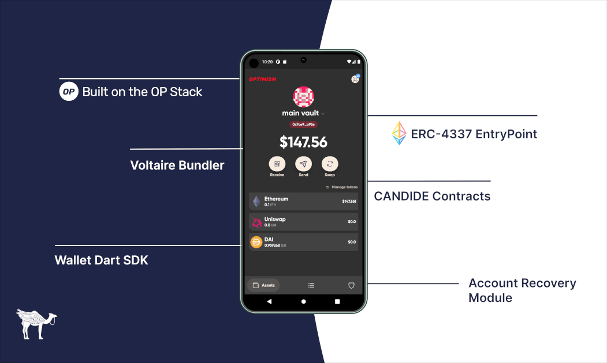

CANDIDE Wallet is an open-source, secure, self-custodial smart contract wallet built on ERC-4337. It leverages account abstraction without compromising on decentralization and censorship resistance. In practical terms, this means a smart contract wallet that doesn't depend on a centralized relayer controlled by a single entity. A gateway to undeniable free access to Ethereum for anyone with a smartphone and internet access.

CANDIDE Wallet Mobile App is powered by a vertically integrated open-source technology stack that delivers an unmatched digital wallet user experience. We highlight the underlying technology we used to build it out. We also explore the reasons those technologies were chosen. Building on the shoulder of giants as we make use of many existing open-source libraries, as well as rolling our own.

## The Contracts

### ERC-4337 EntryPoint
The EntryPoint is the global contract for ERC-4337 Smart Accounts and Paymasters. It coordinates the verification and execution of a UserOperation. The entrypoint contract is [audited by OpenZepplin](https://blog.openzeppelin.com/eip-4337-ethereum-account-abstraction-incremental-audit) and is used by CANDIDE Wallet. The EntryPoint contract has been deployed on multiple chains, in the same address for Ethereum, Polygon, Optimism, Gnosis and other supported networks.

### CANDIDE Wallet Contracts
[CANDIDE Wallet Contracts](https://github.com/candidelabs/CandideWalletContracts/tree/main/contracts/candideWallet) leverage Safe Contracts to be ERC-4337 compatible and efficient. The Contracts implements a Smart Account with 2 essential methods for the EntryPoint to interact with it: `validateUserOp` and `execute`. They also have 2 more methods for both setup and replacing the EntryPoint for upgradability. Learn more about the contracts in this previous [blog post](https://docs.candidewallet.com/blog/unbundling-candide-core-wallet-contract).

### CANDIDE Paymaster Contracts
Paymasters are smart contract accounts that can sponsor transactions for Smart Accounts, enabling fee abstraction for dapps and wallets. Paymaster Sponsorship Options include: 

- **Gasless** - Pay gas fees on behalf of your users, essentially making transactions Gassless
- **Subsidized** - Pay partial gas fees for your users, letting them pay only a discounted gas price
- **Paid with ERC-20** - Allows your users to pay gas with your native ERC-20 token

Paymaster Contracts can be customized to allow for only certain methods, minimum deposits or certain lock durations. In addition, users don't have to worry about gas limits or gas prices since the Paymaster automatically reprices transactions to ensure prompt execution.

### CANDIDE Modules (Plug-ins)
- **Account Recovery** - CANDIDE Wallet implements an on-chain account recovery module. This powers the wallet's seedless experience. In the case of the single-owner account, the signer key is typically stored on the user's device. More specifically, an owner can add recovery methods (also known as Guardians) to change the ownership of the account, in case their signer key is lost or compromised. Learn more about the recovery module in this previous [blog post](https://docs.candidewallet.com/blog/unbundling-candide-core-wallet-contract).

CANDIDE plans to develop more modules in the upcoming weeks and months ahead. Some of the most exciting modules that we also plan to build are Session Keys and Subscriptions. 

- **Session Keys** - allow users to preapprove an application's transactions according to a set of parameters; time, gas usage, set transaction volumes of a token(s), or particular functions on specific contracts. This unlocks a better user experience for apps that leverages session keys.

- **Subscription** - While recurring payments are an important primitive of credit card systems and an important tool for businesses, digital memberships can be reimagined from the ground up using contracts behind the scenes. Subscriptions allow Operators to set rules for how payments are collected, how installments are paid, who gets access, and under what conditions by combining it with NFTs.

## Voltaire - CANDIDE's 4337 Bundler 

Voltaire is a modular, developer-friendly and lighting-fast Python Bundler for Ethereum EIP-4337 Account Abstraction. Voltaire is designed to operate within the peer-to-peer mempool of UserOperations, facilitating the inclusion of transactions on-chain more quickly and efficiently. A good way to think about Voltaire is that it is a software that delivers User Operations but cannot change them, similar to those expected of block-builders. It is incentivized to participate in the network through gas fees and MEV. 

Voltaire is compliant with [Infinitism Compatibility Test Suite](https://github.com/eth-infinitism/bundler-spec-tests). These test suites ensure that different bundlers can communicate effectively and defend against DDoS attack vectors. 

The bundler is [open-source](https://github.com/candidelabs/voltaire), meaning that anyone can launch Voltaire and capture User Operation profits. By participating in the network, the mempool becomes more robust when facing censorship attacks.

## Wallet Dart - SDK for Smart Accounts

Wallet Dart SDK is CANDIDE's set of tools for creating, managing and engaging with ERC-4337 Smart Accounts in mobile client applications. The library's focus on smart contract account architecture gives several advantages to build for cross-platform mobile-friendly wallets. It provides pre-built functions and utilities that allow you to seamlessly interact with Smart Accounts securely and efficiently. Dart is one of the most performant cross-platform languages around; enabling the greatest productivity, with the fewest lines of code.

### Benefits of using Wallet Dart

Using Wallet Dart provides several benefits, including:

- **Mobile First Smart **Accounts** - Easily generate a new Smart Account associated with a user signer. Encrypt and Decrypt the signer with an easy to use open source library
- **ERC-4337 compatible** - Directly integrate with CANDIDE architecture without diving too deep into how the Entrypoint works under the hood
- **Send User Operations** - Send transactions, including ERC20 and NFT transfers and interaction with arbitrary smart contracts, through Voltaire Bundler
- **Account Recovery**  - Offer a recovery mechansm that helps your users access their account without a seed-phrase
- **Enhanced UX** - CANDIDE Paymaster support gasless transactions, improving the user experience and making it more seamless to interact.
- **Better dev experience** - The Wallet Dart SDK abstracts away the complexities of the development *Smart Accounts*, such as cryptography, wallet management, and smart contract interactions, making it easier to build account abstraction applications

Use the Wallet Dart [Library](https://github.com/candidelabs/wallet-dart) and contribute back. More documentation coming soon. Hop on our discord if you need any help.

## Optimism

CANDIDE Wallet is powered by the [OP Stack](https://stack.optimism.io/), the open-source development stack that powers Optimism. An Ethereum layer 2 that improves the scalability and usability of crypto, bringing lower cost gas coupled with lighting fast transactions.

## Modile Client
CANDIDE Mobile Wallet is a cross-platform, mobile first, built with Flutter. CANDIDE Mobile App seamless mobile experiences targets end-users on any mobile device. It is not only built on top of not only the libraries mentioned above but also on top of countless open-source code that was published for free to make it happen. You can get our Beta builds for both Android and iOS on our discord, or by building it yourself on our [github](https://github.com/candidelabs/candide-mobile-app).
